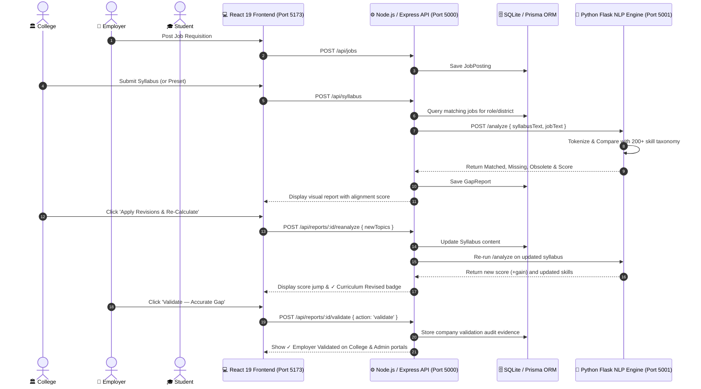

# 🚀 SkillBridge AI — Labour-Market Intelligence & Curriculum Alignment Platform

> **Built for Smart India Hackathon (SIH Problem Statement 26134)**  
> An automated, evidence-based system that connects **Colleges**, **Employers**, **Students**, and **Government Planners** to close the gap between college education and industry requirements.

---

## 📖 Table of Contents
1. [What is SkillBridge AI?](#-what-is-skillbridge-ai)
2. [The Core Problem (In Simple Words)](#-the-core-problem-in-simple-words)
3. [The 4 Portals & Features](#-the-4-portals--features)
   - [1. 🏫 College Portal (Curriculum Hub)](#1--college-portal-curriculum-hub)
   - [2. 🏢 Employer & Industry Hub](#2--employer--industry-hub)
   - [3. 🎓 Student Upskilling Portal](#3--student-upskilling-portal)
   - [4. 🏛️ Government & Directorate Command Center](#4-️-government--directorate-command-center)
4. [New Closed-Loop Workflow (Step-by-Step)](#-new-closed-loop-workflow-step-by-step)
   - [Revise Curriculum & Re-Analyze](#-revise-curriculum--re-analyze)
   - [Create District Training Plan](#-create-district-training-plan)
   - [Employer Validation & Dispute](#-employer-validation--dispute)
   - [Forward Demand Signals (Consultations)](#-forward-demand-signals-consultations)
5. [System Architecture](#-system-architecture)
6. [Tech Stack](#-tech-stack)
7. [How to Run the Project Locally](#-how-to-run-the-project-locally)
8. [Demo Login Credentials](#-demo-login-credentials)
9. [REST API Reference](#-rest-api-reference)
10. [Quick Demo Guide (For Judges & Evaluators)](#-quick-demo-guide-for-judges--evaluators)

---

## 💡 What is SkillBridge AI?

In most universities, **syllabi are updated only once every 3 to 5 years**, while industry technologies change every 6 to 12 months. As a result:
- Colleges teach older tools (e.g. Turbo C++, basic HTML, theoretical DBMS).
- Companies struggle to find graduates who know modern tools (Docker, AWS, React, CI/CD).
- Students don't know what skills are actually in demand in their district.

**SkillBridge AI fixes this by creating a live, connected loop:**
1. **Companies** post job vacancies and future skill demands.
2. **AI Engine** reads college syllabi, compares them with live job postings, and calculates an **Alignment Score** (0–100%).
3. **Colleges** can update their syllabus on the spot to immediately see their score jump and generate district training blueprints.
4. **Companies** review and officially validate or dispute the college's gap reports.
5. **Students** assess their own skills, get personalized course suggestions, and explore salary pathways.
6. **Government** gets a state-wide command center with live charts, placement rates, and district training roadmaps.

---

## 🎯 The Core Problem (In Simple Words)

| The Problem | How SkillBridge AI Solves It |
| :--- | :--- |
| **Outdated Syllabi** | The ML engine scans syllabus text, detects obsolete tools, and finds missing industry skills. |
| **No Industry Feedback** | Companies can click **"Validate — Accurate Gap"** or **"Dispute"** to verify findings with audit proof. |
| **Delayed Curriculum Updates** | The **"Closed-Loop"** tool allows colleges to append missing skills and re-calculate their score in seconds. |
| **Delayed Bridge Courses** | The **"Create District Training Plan"** button creates an immediate training plan (mentors, labs, duration) for that district. |
| **Students Confused About Careers** | Students input what they know and get a readiness score, suitable jobs, and step-by-step salary pathways. |
| **Untracked Placements** | Colleges log verified placements to measure if updated syllabi actually resulted in jobs. |

---

## 👥 The 4 Portals & Features

```
                                  ┌────────────────────────┐
                                  │     SkillBridge AI     │
                                  └───────────┬────────────┘
                                              │
          ┌───────────────────┬───────────────┴───────────────┬───────────────────┐
          ▼                   ▼                               ▼                   ▼
    🏫 College Portal   🏢 Employer Hub                 🎓 Student Portal   🏛️ Admin Dashboard
   ─────────────────   ────────────────                ────────────────    ───────────────────
   • Syllabus Upload   • Post Job Requisitions         • Personal AI Test  • State Telemetry
   • AI Gap Auditing   • Forward Demand Signals        • Live Job Matches  • District Demand
   • Closed-Loop Fix   • Validate Gap Reports          • Career Pathways   • Equipment & Labs
   • Training Plans    • Quality Survey Ratings        • Certified Courses • Placement Trends
   • Placement Ledger                                  • Skill Trend Radar • Validation Audits
```

---

### 1. 🏫 College Portal (Curriculum Hub)
* **Syllabus Ingestion with Sample Presets:** Upload any department syllabus or click 1-click sample presets (*Data Analyst*, *Web Developer*, *Cloud & DevOps*).
* **AI Gap Analysis:** Compares syllabus against active job market demand. Identifies:
  - 🔴 **Missing Industry Skills** (skills companies want that syllabus lacks).
  - 🟢 **Covered Competencies** (skills already taught).
  - ⚠️ **Obsolete Topics** (outdated tools like Turbo C++, Flash, Visual Basic).
* **Recommended Modernizations:** Shows recommended courses from NPTEL, Coursera, Udemy with duration and difficulty.
* **Closed-Loop Syllabus Revision:** Type or paste missing skills into the revision box and click **Apply Revisions** to immediately watch the alignment score jump (e.g. from 40% $\to$ 95%) and remove them from missing skills.
* **Create District Training Plan:** Sends missing skills directly to the blueprint generator to calculate mentor hours, lab equipment, and timelines.
* **Graduate Placement Registry:** Log verified student job offers (company, package, role, location) to measure ROI.

---

### 2. 🏢 Employer & Industry Hub
* **Job Requisitions:** Post active vacancies with title, required skills, sector, location, and salary package (e.g. `6-10 LPA`).
* **Forward Demand Signals (Industry Consultations):** Submit future hiring needs for the next 3 to 24 months (e.g., *need 50 Kubernetes & Generative AI engineers in Jaipur in 6 months*).
* **Validate Gap Reports:** Review AI-generated college gap reports and click:
  - **`Validate — Accurate Gap`**: Confirms the gap is real and stores company name as audit evidence.
  - **`Dispute Report`**: Flags that local industry does not need those skills.

---

### 3. 🎓 Student Upskilling Portal
* **Market Skill Gaps:** View the top missing skills across all regional colleges.
* **Personal Skill Assessment:** Enter your own skills and select your target role/district. The AI calculates your readiness score (0-100%) and shows:
  - Missing and matched skills.
  - Suitable jobs in your district with match percentages and hiring companies.
  - Recommended free and certified courses.
  - Local hiring statistics and typical salary ranges.
* **Dynamic Career Pathways:** View career levels (Entry $\to$ Mid $\to$ Senior), expected packages (e.g. 5 LPA $\to$ 12 LPA $\to$ 22 LPA), and key focus areas.
* **Skill Trends Radar:** Live classification of skills into **Rising**, **Stable**, and **Declining** technologies.

---

### 4. 🏛️ Government & Directorate Command Center
* **Live State Telemetry:** Counts of total jobs, syllabi audited, registered colleges/employers, and average curriculum alignment.
* **Roles & Skill Demand:** Ranked lists of the most demanded job roles and skills across the state.
* **Curriculum Alignment Audit Table:** Shows every college's score, revision status (`✓ Revised`), and employer verification status (`✓ Verified`).
* **District-Wise Demand:** Heatmap of job openings, top roles, and top skills per district (Jaipur, Jodhpur, etc.).
* **Training & Equipment Plans:** Aggregates regional trainer quotas and hardware/lab requirements.
* **Placement Outcomes:** Tracks placement conversion rate, package distribution, and role-wise hiring.

---

## 🔄 New Closed-Loop Workflow (Step-by-Step)

Here are the four key workflows added to the system and how they work:

### 1. 🚀 Revise Curriculum & Re-Analyze
- **Location:** College Dashboard $\to$ Gap Reports tab.
- **How it works:**
  1. Under any gap report, click **"Revise Curriculum & Re-Analyze"**.
  2. A revision box opens, automatically pre-populated with the missing industry skills.
  3. You can keep all skills or add specific course modules.
  4. Click **"Apply Revisions & Re-Calculate Alignment"**.
  5. The backend appends these modules directly to the stored syllabus and calls the Python ML Engine.
  6. **Result:** The skills you added are removed from "Missing Skills" and moved into "Covered Competencies". The **Alignment Score jumps** (e.g. +50% gain), and the report receives a **`✓ Curriculum Revised`** badge.

### 2. 📍 Create District Training Plan
- **Location:** College Dashboard $\to$ Gap Reports tab.
- **How it works:**
  1. Click **"Create District Training Plan"** on any gap report.
  2. The system grabs the missing skills and the college's district, automatically opens the **Training Plans** tab, and fills in the form.
  3. Clicking **"Generate Training Blueprint"** invokes the ML engine to calculate:
     - **Trainer Quota:** How many specialized mentors are needed.
     - **Equipment & Labs:** What hardware/cloud resources are required.
     - **Timeline:** Estimated training duration (weeks/months).
     - **Curriculum Units:** Specific courses from Udemy/NPTEL.
     - **Oversupply Warning:** Flags if any skills are already oversaturated in that district.

### 3. ✅ Employer Validation & Dispute
- **Location:** Company Dashboard $\to$ Validate Gap Reports tab.
- **How it works:**
  1. Companies see all college gap reports.
  2. They can type feedback (e.g. *"Confirmed: Docker and CI/CD are essential for freshers"*).
  3. Click **"Validate — Accurate Gap"**:
     - Card turns green with a `✓ Employer Validated` badge.
     - In the College Dashboard, an **Employer Validation Evidence** banner appears showing the company name.
     - In the Admin Dashboard, the status changes from `Pending` to **`✓ Verified`**.
  4. Click **"Dispute Report"**:
     - Card turns red with an `✗ Employer Disputed` badge so colleges avoid teaching unnecessary topics.

### 4. 📡 Forward Demand Signals (Consultations)
- **Location:** Company Dashboard $\to$ Industry Demand Signals tab.
- **How it works:**
  1. Companies select their Sector, District, Target Roles, and Anticipated Skills (e.g. Kubernetes, Generative AI).
  2. They choose a hiring timeline (*3 months*, *6 months*, *12 months*, *2+ years*) and priority (*High*, *Medium*, *Low*).
  3. Clicking **"Transmit Demand Signal"** saves the signal and displays it immediately in the right-side consultation list.
  4. This allows regional training institutes and colleges to prepare courses 6 to 12 months *before* the hiring wave starts.

---

## 🏗️ System Architecture



---

## 🛠️ Tech Stack

* **Frontend:** React 19, Vite, React Router v7, Lucide React, Chart.js, Vanilla CSS (OKLCH light theme).
* **Backend:** Node.js, Express.js, TypeScript (`tsx`), Prisma ORM.
* **Database:** SQLite (`dev.db`).
* **ML / NLP Engine:** Python 3.10+, Flask, Flask-CORS, Regex boundary matching, 200+ skill taxonomy across 6 sectors.
* **Authentication:** JWT (JSON Web Tokens) with Bcrypt password hashing.

---

## 💻 How to Run the Project Locally

### Prerequisites
- **Node.js** (v18 or higher)
- **Python** (v3.10 or higher)
- **Git**

---

### Step 1: Start the Python ML Engine
Open Terminal 1:
```bash
cd "College Project/ml-engine"

# Activate virtual environment
# Windows:
.\venv\Scripts\activate
# macOS/Linux:
# source venv/bin/activate

# Install requirements (if first time)
pip install flask flask-cors

# Start server (runs on port 5001)
python app.py
```

---

### Step 2: Start the Backend API
Open Terminal 2:
```bash
cd "College Project/backend"

# Install dependencies (if first time)
npm install

# Initialize database
npx prisma db push

# Start server (runs on port 5000)
npx tsx src/index.ts
```

---

### Step 3: Start the Frontend Client
Open Terminal 3:
```bash
cd "College Project/frontend"

# Install dependencies (if first time)
npm install

# Start Vite dev server (runs on port 5173)
npm run dev
```

---

### Step 4: Open in Browser & Seed Data
1. Open [http://localhost:5173](http://localhost:5173) in your browser.
2. Click **Admin** in the top-right navigation.
3. Click the button **"Reset & Seed Demo Scenario"** to automatically populate sample jobs, colleges, gap reports, and surveys.

---

## 🔑 Demo Login Credentials

All demo accounts use the password: **`demo123`**

| Role | Email | Password | What to explore |
| :--- | :--- | :--- | :--- |
| **🎓 Student** | `student@demo.com` | `demo123` | Personal AI assessment, live job matches, career pathways |
| **🏫 College** | `jiet@demo.com` | `demo123` | Upload syllabus, revise & re-analyze, district training plans |
| **🏢 Company** | `tcs@demo.com` | `demo123` | Post jobs, transmit demand signals, validate gap reports |
| **🏢 Company (Alt)** | `infosys@demo.com` | `demo123` | Test multi-company validation and dispute workflows |
| **🏛️ Admin** | `admin@demo.com` | `demo123` | Macro state analytics, district demand, validation audit log |

---

## 📡 REST API Reference

| Method | Endpoint | Role | What it does |
| :--- | :--- | :--- | :--- |
| `POST` | `/api/auth/register` | Public | Register new user (Student, College, Company) |
| `POST` | `/api/auth/login` | Public | Login and receive JWT token |
| `POST` | `/api/jobs` | `COMPANY` | Post a job requisition (Title, skills, salary, location) |
| `GET` | `/api/jobs` | Public | List all active job postings |
| `POST` | `/api/syllabus` | `COLLEGE` | Submit syllabus & trigger ML gap analysis |
| `GET` | `/api/reports` | Public | Fetch all curriculum gap reports |
| `POST` | `/api/reports/:id/reanalyze` | `COLLEGE` | **Closed-loop revision:** Append topics & re-calculate alignment |
| `POST` | `/api/reports/:id/validate` | `COMPANY` | **Validation:** Employer validates or disputes a gap report |
| `POST` | `/api/consultations` | `COMPANY` | **Demand Signal:** Submit 3–24 month future hiring signals |
| `GET` | `/api/consultations` | Public | List all submitted industry consultations |
| `POST` | `/api/training-plans` | Public | Generate district blueprint (trainers, equipment, timeline) |
| `GET` | `/api/training-plans` | Public | List all active district blueprints |
| `POST` | `/api/student/evaluate` | Public | Match student skills to real market vacancies |
| `GET` | `/api/career-pathways` | Public | Dynamic role salary bands and required skill clusters |
| `POST` | `/api/placements` | `COLLEGE`, `ADMIN` | Log verified student job placements |
| `GET` | `/api/analytics/dashboard`| Public | State-level telemetry and governance metrics |

---

## 🎯 Quick Demo Guide (For Judges & Evaluators)

Follow this 5-minute walkthrough to test all features:

1. **Seed Sample Data:** Go to `/admin` and click **"Reset & Seed Demo Scenario"**.
2. **Test Closed-Loop Revision (College):**
   - Log in as `jiet@demo.com` (`demo123`).
   - Go to the **Gap Reports** tab.
   - Look at the Alignment Index (e.g. 42%).
   - Click **"Revise Curriculum & Re-Analyze"**.
   - Click **"Apply Revisions & Re-Calculate Alignment"**.
   - 🎉 **Watch the score jump to 90%+**, missing skills disappear into covered competencies, and the badge change to `✓ Curriculum Revised`.
3. **Test District Training Plan:**
   - Click **"Create District Training Plan"** on any report.
   - Click **"Generate Training Blueprint"** to see required mentors, lab equipment, and timelines.
4. **Test Employer Validation (Company):**
   - Log out and log in as `tcs@demo.com` (`demo123`).
   - Go to **Validate Gap Reports**.
   - Type a note and click **"Validate — Accurate Gap"**.
   - Notice the green badge `✓ Employer Validated`.
5. **Verify Feedback Loop in College & Admin:**
   - Log back into College or Admin $\rightarrow$ see the **Employer Validation Evidence** banner and `✓ Verified` status!
6. **Test Student Assessment:**
   - Log in as `student@demo.com` (`demo123`).
   - Go to **Personal Assessment** $\rightarrow$ Click **"⚡ Load Demo"** $\rightarrow$ Click **"Evaluate My Industry Readiness"**.
   - See your score, suitable job openings with hiring companies, and career pathway.

---

## 📜 Acknowledgments
Developed for **Smart India Hackathon (Problem Statement 26134)** to solve the disconnect between Indian technical education and industry demand through automated, evidence-based intelligence.
