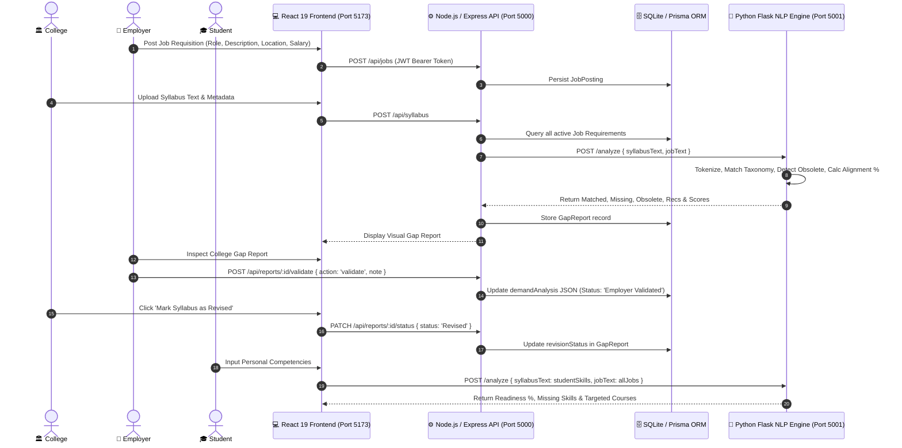

# SkillBridge AI — Labour-Market Intelligence & Curriculum-Alignment Platform
> **Solving SIH Problem Statement 26134:** A continuous, evidence-based closed-loop mechanism translating real-time industry demand into curriculum design, district capacity planning, trainer allocation, and candidate career guidance.

---

## 📑 Table of Contents
1. [Executive Summary](#-executive-summary)
2. [WHY: Problem Context & Motivation](#-why-problem-context--motivation)
3. [WHAT: The Solution & System Overview](#-what-the-solution--system-overview)
4. [Problem Statement Coverage Matrix (SIH PS 26134)](#-problem-statement-coverage-matrix-sih-ps-26134)
5. [System Architecture & Data Flow](#-system-architecture--data-flow)
6. [Technology Stack](#-technology-stack)
7. [Repository & Folder Structure](#-repository--folder-structure)
8. [Core Modules & Feature Breakdown](#-core-modules--feature-breakdown)
   - [1. Student Upskilling & Career Guidance Portal](#1-student-upskilling--career-guidance-portal)
   - [2. College Curriculum Auditing & Alignment Hub](#2-college-curriculum-auditing--alignment-hub)
   - [3. Employer Requisition & Validation Center](#3-employer-requisition--validation-center)
   - [4. District-Level Training Plan Generator](#4-district-level-training-plan-generator)
   - [5. Macro Analytics & Governance Dashboard](#5-macro-analytics--governance-dashboard)
   - [6. Python NLP Intelligence Engine](#6-python-nlp-intelligence-engine)
9. [The ML/NLP Engine & Algorithmic Formulation](#-the-mlnlp-engine--algorithmic-formulation)
10. [REST API Documentation](#-rest-api-documentation)
11. [Installation & Setup Guide](#-installation--setup-guide)
12. [Pre-Configured Demo Credentials](#-pre-configured-demo-credentials)
13. [Future Roadmap & Scaling](#-future-roadmap--scaling)

---

## 🎯 Executive Summary

In traditional educational ecosystems, **academic curricula lag real-world technological advancements by 3 to 5 years**. Engineering colleges frequently teach sunsetting technologies (e.g., Turbo C++, legacy DBMS, obsolete web standards), while employers struggle to hire job-ready candidates skilled in Cloud Architecture, DevOps, Generative AI, and modern software engineering paradigms.

**SkillBridge AI** establishes an automated, evidence-based feedback loop connecting four critical stakeholders:
1. **Industry (Employers):** Ingests live job requirements, collects forward-looking demand signals, and enables companies to validate or dispute college curriculum gap reports.
2. **Academia (Colleges & Universities):** Parses raw syllabi with NLP, computes an objective alignment score against active industry demand, highlights obsolete topics, and suggests targeted modular course updates.
3. **Candidates (Students):** Provides personalized gap assessments against active requisitions, maps dynamic career pathways with salary benchmarks, and suggests curated upskilling resources.
4. **Government & District Planners (Admin):** Generates actionable district-level training blueprints detailing required domain mentors, lab equipment, and timelines, while tracking evidence-loop closure.

---

## 💡 WHY: Problem Context & Motivation

### The Industry-Academia Disconnect
- **Bureaucratic Curriculum Cycles:** Universities and accreditation bodies follow lengthy syllabus revision processes (often 3–5 years). In contrast, the software and engineering landscape introduces major framework iterations every 6–12 months.
- **The "Job-Ready Freshers" Paradox:** Companies spend months and millions of rupees retraining new engineering recruits in basic modern competencies (Docker, Cloud, Git, TypeScript, REST APIs) that could have been integrated into undergraduate labs.
- **Legacy Occupational Frameworks:** Traditional skill programs categorize jobs into broad, static categories (e.g., "Computer Programmer") that obscure granular, high-value micro-skills (e.g., Kubernetes, PyTorch, CI/CD).
- **Lack of Evidence-Based District Planning:** Regional vocational training centers (ITIs, polytechnics) often purchase equipment or run batches based on intuition rather than empirical district hiring signals, resulting in market oversupply of redundant skills.

### How SkillBridge AI Solves This
SkillBridge AI replaces subjective committees and guesswork with an **algorithmic, closed-loop telemetry system**:
- Real-time job posting ingestion replaces periodic static employer surveys.
- Natural Language Processing (NLP) extracts micro-skills from unformatted job descriptions and raw syllabus texts.
- Bidirectional verification empowers companies to certify that university updates meet industry standards.
- District-level blueprints calculate trainer quotas, laboratory hardware, and execution timelines before government funds are committed.

---

## 🌐 WHAT: The Solution & System Overview

SkillBridge AI is a unified, multi-tenant web platform supported by a Python NLP intelligence microservice. It provides tailored portals for each user persona:

```
                                  ┌────────────────────────┐
                                  │      SkillBridge AI    │
                                  │     Unified Platform   │
                                  └───────────┬────────────┘
                                              │
         ┌───────────────────┬────────────────┴────────────────┬───────────────────┐
         ▼                   ▼                                 ▼                   ▼
┌─────────────────┐ ┌─────────────────┐               ┌─────────────────┐ ┌─────────────────┐
│ Student Portal  │ │ College Portal  │               │ Employer Portal │ │  Admin Portal   │
├─────────────────┤ ├─────────────────┤               ├─────────────────┤ ├─────────────────┤
│• Personal AI Gap│ │• Syllabus Upload│               │• Job Requisition│ │• Macro Analytics│
│  Assessment     │ │• Gap Analysis   │               │  Posting        │ │• Sector Growth  │
│• Career Pathways│ │• Obsolete Alerts│               │• Forward Signals│ │• Placement Rates│
│• Skill Trends   │ │• Training Plans │               │• Gap Validation │ │• Loop Audit     │
│• Course Recs    │ │• Placement Reg  │               │• Survey Channel │ │• District Tele  │
└─────────────────┘ └─────────────────┘               └─────────────────┘ └─────────────────┘
```

---

## ✅ Problem Statement Coverage Matrix (SIH PS 26134)

| Problem Statement Requirement from `PS.txt` | Addressed in SkillBridge AI | Implementation Details & Code Reference | Status |
| :--- | :---: | :--- | :---: |
| **Replace broad/historical occupation categories with real-time skills** | **YES** | 200+ multi-sector micro-skill taxonomy in [`ml-engine/app.py`](file:///d:/College%20Project/ml-engine/app.py) categorizing skills by sector, category, demand, and trend. | **100%** |
| **Job-posting signals ingestion** | **YES** | Multi-sector job requisition manager in [`backend/src/index.ts`](file:///d:/College%20Project/backend/src/index.ts#L75-L107) with automated NLP parsing. | **100%** |
| **Employer surveys & feedback** | **YES** | Structured satisfaction ratings, candidate quality distribution, and urgent skill requests via `/api/surveys`. | **100%** |
| **Industry consultations for upcoming demand** | **YES** | Dedicated forward-looking demand signal module (`/api/consultations`) capturing 3–24 month requirements. | **100%** |
| **Sector growth data analysis** | **YES** | Dynamic sector breakdown (IT, Mechanical, Civil, Electronics, Management, Healthcare) tracked in Admin telemetry. | **100%** |
| **Placement outcome tracking** | **YES** | Graduate placement ledger (`PlacementRecord` model) calculating verified placement conversion rates. | **100%** |
| **Emerging-technology trends identification** | **YES** | Real-time classification into Rising, Stable, and Declining competencies (`/api/skills/trends`). | **100%** |
| **Demand by role, skill, location & proficiency** | **YES** | Multi-axial indexing across job roles, specific skills, district locations, and proficiency tiers (Beginner, Intermediate, Advanced). | **100%** |
| **Map skill gaps to courses & update recommendations** | **YES** | Algorithmic curriculum recommendations mapped to certified providers (NPTEL, Coursera, Stanford, etc.). | **100%** |
| **Flag obsolete or oversupplied courses** | **YES** | Automated regex flagging of deprecated technologies (`OBSOLETE_SKILLS`) & regional saturation detection. | **100%** |
| **Support employer validation of gap reports** | **YES** | Two-way verification endpoint (`/api/reports/:id/validate`) allowing industry partners to validate or dispute findings. | **100%** |
| **Generate district-level training plans** | **YES** | Comprehensive blueprint generator (`/generate-training-plan`) providing trainer quotas, lab equipment, and timelines. | **100%** |
| **Clearer career pathways for candidates** | **YES** | Real-time career trajectory engine mapping high-demand roles, salary bands, and prerequisite skills. | **100%** |
| **Timely course revision tracking** | **YES** | College audit lifecycle with `"Mark Syllabus as Revised"` mechanism to record institutional compliance. | **100%** |

---

## 🏗️ System Architecture & Data Flow



---

## 🛠️ Technology Stack

### Frontend Client
- **Framework:** React 19 (`react`, `react-dom`) with Vite 8 bundler.
- **Routing:** React Router v7 (`react-router-dom`) with role-based protected routes.
- **Icons:** Lucide React (`lucide-react`) for clean, consistent UI iconography.
- **Data Visualization:** Chart.js 4 and React-Chartjs-2.
- **HTTP Client:** Axios with centralized base URL configuration.
- **Design System:** Custom **OKLCH Design Token System** in Vanilla CSS:
  - High-fidelity light mode with curated perceptual color palettes.
  - Crisp, professional borders with reduced border-radius (`--radius: 0.25rem` / 4px).
  - Glassmorphic panels, structured stat cards, and accessible data tables.

### Backend API Server
- **Runtime:** Node.js with TypeScript (`tsx` execution engine).
- **Framework:** Express.js with JSON body parsing and CORS support.
- **Database & ORM:** SQLite via Prisma ORM (`@prisma/client`).
- **Authentication:** Stateless JSON Web Tokens (JWT) with Bcryptjs password hashing.
- **Inter-service Communication:** Axios for communicating with the Python ML microservice.

### AI / NLP Microservice
- **Runtime:** Python 3.10+ with Flask and Flask-CORS.
- **NLP Processing:** Custom regex boundary tokenizer, multi-word n-gram matcher, and skill alias normalizer.
- **Domain Taxonomy:** Curated ontology of 200+ technical, engineering, management, and soft skills across 6 distinct sectors.
- **Recommendation Engine:** Rule-based curriculum mapper linked to accredited course curricula (NPTEL, Coursera, EdX).

---

## 📂 Repository & Folder Structure

```
College Project/
│
├── .gitignore                          # Root Git ignore configuration
├── PS.txt                              # Original SIH Problem Statement 26134
├── SIH_Presentation_Guide.doc          # Presentation script and speaking guide
├── SIH_Presentation_Roadmap.doc        # Comprehensive hackathon roadmap document
├── project_exam_answers.md             # Academic question-answer project dossier
│
├── backend/                            # Node.js + Express + TypeScript Backend
│   ├── .env                            # Environment variables (PORT, JWT_SECRET, etc.)
│   ├── dev.db                          # SQLite production/development database file
│   ├── package.json                    # Backend dependencies and execution scripts
│   ├── tsconfig.json                   # TypeScript compiler configuration
│   ├── prisma/
│   │   └── schema.prisma               # Prisma data schema (8 relational models)
│   ├── src/
│   │   └── index.ts                    # Main API server, auth, routing, and controller logic
│   └── test_dynamics.js                # API integration test suite
│
├── frontend/                           # React 19 + Vite Frontend Application
│   ├── index.html                      # HTML5 entrypoint with Inter typography
│   ├── package.json                    # Frontend dependencies (React, Lucide, Chart.js)
│   ├── vite.config.ts                  # Vite build and server configuration
│   └── src/
│       ├── main.jsx                    # React DOM root bootstrapping
│       ├── App.jsx                     # Route definitions & Role-based ProtectedRoute wrapper
│       ├── api.js                      # Base API endpoint configuration
│       ├── index.css                   # Global OKLCH design system & utility classes
│       └── pages/
│           ├── Home.jsx                # Landing page with platform capabilities & live stats
│           ├── Login.jsx               # Unified authentication & registration portal
│           ├── StudentDashboard.jsx    # Student gap assessment, trends, & career pathways
│           ├── CollegeDashboard.jsx    # Syllabus upload, gap reports, & placement tracking
│           ├── CompanyDashboard.jsx    # Job posting, industry consultation, & validation
│           └── AdminDashboard.jsx      # Macro analytics, sector growth, & quality audit
│
└── ml-engine/                          # Python Flask NLP Intelligence Microservice
    ├── app.py                          # NLP gap analyzer, taxonomy, & training plan generator
    └── venv/                           # Python isolated virtual environment
```

---

## 🚀 Core Modules & Feature Breakdown

### 1. Student Upskilling & Career Guidance Portal
- **Market Skill Gaps:** Aggregates and ranks the most acute missing competencies across all audited syllabi in the student's region.
- **Personal AI Skill Assessment:** Allows students to input their self-reported skills and benchmark them against real requisitions for specific job roles or across the entire job market. Computes an **Industry Readiness Score** (0–100%).
- **Curated Course Recommendations:** Direct links to certified courses (NPTEL, Coursera) for skills flagged as missing in the assessment.
- **Dynamic Career Pathways:** Automatically clusters active job postings by title to compute average salary bands, demand intensity (High vs. Very High), and mandatory prerequisite skills.
- **Skill Trend Radar:** Classifies skills into Emerging, Stable, and Sunsetting technologies to prevent students from investing time in declining tools.

### 2. College Curriculum Auditing & Alignment Hub
- **Syllabus Ingestion Engine:** Accepts branch, semester, course content, and last revision year.
- **Automated Gap Reports:** Generates an empirical **Alignment Index** percentage comparing syllabus topics against live employer postings.
- **Obsolete Topic Alerts:** Explicitly flags deprecated tools (e.g., Turbo C++, Flash, Visual Basic) with recommendations for modern replacements.
- **Curriculum Modernization Table:** Outputs a tabular course update proposal indicating recommended modules, estimated duration, and certified providers.
- **Audit Revision Confirmation:** Features a **"Mark Syllabus as Revised"** workflow that officially records that academic faculty have acted on the gap report.
- **Placement Outcome Registry:** Allows institutions to log verified student placements, recording packages, locations, and hiring partners to track ROI.

### 3. Employer Requisition & Validation Center
- **Job Requisition Management:** Companies register open vacancies with sector classification, proficiency level, location, and compensation packages.
- **Forward-Looking Demand Signals (Industry Consultations):** Captures 3 to 24-month anticipatory hiring needs, emerging tooling expectations, and urgency levels to shape regional training programs before skill shortages occur.
- **Bidirectional Report Validation:** Industry representatives review college gap analysis reports and mark them as **"Employer Validated"** or **"Employer Disputed"** with qualitative notes.

### 4. District-Level Training Plan Generator
- Generates localized vocational and engineering upskilling plans based on district parameters.
- **Trainer Capacity Planning:** Quantifies the exact domain experts required per batch (e.g., "Cloud domain expert", "AI/ML domain expert").
- **Infrastructure & Laboratory Quotas:** Automatically specifies physical lab tooling (e.g., "Workstations with CAD software licenses", "Electronics Lab with microcontrollers").
- **Timeline & Batch Estimation:** Computes realistic rollout horizons (3–12 months) and recommended student batch sizes.
- **Market Saturation Warnings:** Identifies oversupplied or obsolete skills in the district that should not receive training allocation.

### 5. Macro Analytics & Governance Dashboard
- **System Telemetry:** Real-time counters for registered users, job postings, gap reports, and mean curriculum alignment.
- **Sector Growth Velocity:** Comparative bar graphs tracking job creation rates across IT, Mechanical, Civil, Healthcare, and Management.
- **Proficiency Level Breakdown:** Visualizes market demand across Beginner, Intermediate, and Advanced tiers.
- **Employer Sentiment Analytics:** Aggregates satisfaction scores (1–5) and candidate quality distributions.
- **Closed-Loop Quality Indicators:** Quantifies the number of reports certified by employers and the number of curricula verified as revised.

---

## 🧠 The ML/NLP Engine & Algorithmic Formulation

### 1. Skill Extraction & Normalization
The NLP engine utilizes boundary-checked n-gram extraction against a 200+ skill taxonomy:
$$\text{SkillMatch}(T) = \{ s \in \mathcal{S} \mid \text{Regex}(\backslash b s \backslash b) \text{ matches } \text{Normalize}(T) \}$$
Where $\mathcal{S}$ is sorted by string length descending to prioritize multi-word tokens (e.g., `Machine Learning` before `Learning`). An alias resolution map standardizes variations such as `reactjs` $\to$ `react` and `nodejs` $\to$ `node.js`.

### 2. Curriculum Alignment Index Formula
The overall curriculum-industry alignment score is formulated as:
$$\text{AlignmentScore} = \text{round}\left( \frac{|\mathcal{M}_{\text{job}} \cap \mathcal{M}_{\text{syllabus}}|}{|\mathcal{M}_{\text{job}}|} \times 100 \right)$$
Where:
- $\mathcal{M}_{\text{job}}$ is the set of unique skills extracted from active job requisitions.
- $\mathcal{M}_{\text{syllabus}}$ is the set of unique skills extracted from the submitted syllabus.

### 3. Proficiency Tier Inference
Proficiency requirements are dynamically inferred from textual keywords in job postings:
- **Advanced:** Presence of tokens `senior`, `lead`, `architect`, `expert`, `principal`, `5+ years`, `8+ years`.
- **Beginner:** Presence of tokens `junior`, `intern`, `fresher`, `entry level`, `trainee`, `0-1 year`.
- **Intermediate:** Default classification in the absence of explicit polarity keywords.

---

## 📡 REST API Documentation

| Method | Endpoint | Access Role | Description |
| :--- | :--- | :--- | :--- |
| `POST` | `/api/auth/register` | Public | Register a new user (STUDENT, COLLEGE, COMPANY) |
| `POST` | `/api/auth/login` | Public | Authenticate user and receive JWT bearer token |
| `POST` | `/api/jobs` | `COMPANY` | Post a new job requisition with auto-NLP skill extraction |
| `GET` | `/api/jobs` | Public | Fetch all active job requisitions |
| `POST` | `/api/syllabus` | `COLLEGE` | Upload syllabus text, execute ML gap audit, create GapReport |
| `GET` | `/api/syllabus` | Public | Fetch all uploaded institutional syllabi |
| `GET` | `/api/reports` | Public | List all generated curriculum gap reports |
| `POST` | `/api/reports/:id/validate` | `COMPANY` | Validate or dispute a college gap report |
| `PATCH`| `/api/reports/:id/status` | `COLLEGE` | Mark a syllabus report as `'Revised'` |
| `POST` | `/api/surveys` | `COMPANY` | Submit employer satisfaction survey & candidate quality rating |
| `GET` | `/api/surveys/stats` | Public | Aggregated survey metrics and quality distribution |
| `POST` | `/api/consultations` | `COMPANY` | Transmit forward-looking industry demand signals |
| `GET` | `/api/consultations` | Public | List all submitted industry consultation signals |
| `POST` | `/api/placements` | `COLLEGE`, `ADMIN` | Log a verified student placement record |
| `GET` | `/api/placements/stats` | Public | Placement rates, location breakdown, and role distributions |
| `GET` | `/api/career-pathways` | Public | Dynamic role clustering, salary averages, and top skills |
| `POST` | `/api/training-plans` | Public | Generate district blueprint with trainers, equipment, & timeline |
| `GET` | `/api/training-plans` | Public | List all generated district training blueprints |
| `GET` | `/api/skills/taxonomy` | Public | Retrieve complete 200+ skill taxonomy from ML Engine |
| `GET` | `/api/skills/trends` | Public | Retrieve rising, stable, and declining skill classifications |
| `GET` | `/api/analytics/dashboard`| Public | Comprehensive system telemetry, sector growth, and indicators |
| `POST` | `/api/seed` | Public | Populate database with realistic demo accounts and records |

---

## 💻 Installation & Setup Guide

### Prerequisites
- **Node.js** (v18.0.0 or higher) & **npm**
- **Python** (v3.10 or higher) with `pip`
- **Git**

---

### Step 1: Clone the Repository
```bash
git clone <repository-url>
cd "College Project"
```

---

### Step 2: Set Up and Run the Python ML Engine
```bash
cd ml-engine

# Create virtual environment
python -m venv venv

# Activate virtual environment
# Windows:
.\venv\Scripts\activate
# macOS/Linux:
# source venv/bin/activate

# Install dependencies
pip install flask flask-cors

# Start the ML Engine (runs on port 5001)
python app.py
```

---

### Step 3: Set Up and Run the Backend API
Open a second terminal window:
```bash
cd backend

# Install dependencies
npm install

# Initialize the SQLite database schema
npx prisma db push

# Start the Backend server (runs on port 5000)
npx tsx src/index.ts
```

---

### Step 4: Set Up and Run the Frontend Client
Open a third terminal window:
```bash
cd frontend

# Install dependencies
npm install

# Start Vite development server (runs on port 5173)
npm run dev
```

---

### Step 5: Seed Demo Data
Once all three services are running:
1. Open your browser and navigate to `http://localhost:5173`.
2. Click on the **Admin** button in the top navigation bar.
3. Click the **"Load Sample Data"** button to automatically populate realistic job postings, colleges, gap reports, and surveys.

---

## 🔑 Pre-Configured Demo Credentials

After seeding sample data, the following pre-configured accounts are available (password for all demo accounts is **`demo123`**):

| Role | Email | Password | Intended Portal | Primary Actions |
| :--- | :--- | :--- | :--- | :--- |
| **Student** | `student@demo.com` | `demo123` | `/student` | Run personal skill assessment, explore career pathways |
| **College** | `jiet@demo.com` | `demo123` | `/college` | Upload syllabus, view gap reports, mark curriculum revised |
| **Company** | `tcs@demo.com` | `demo123` | `/company` | Post job requisitions, submit demand signals, validate reports |
| **Company** | `infosys@demo.com`| `demo123` | `/company` | Alternate corporate account for multi-company validation |
| **Admin** | `admin@demo.com` | `demo123` | `/admin` | Inspect macro analytics, sector growth, and loop closure |

---

## 🔮 Future Roadmap & Scaling

1. **Document OCR & Parser Integrations:** Implement automated parsing of PDF syllabi, scanned accreditation reports, and unstructured DOCX files using Tesseract OCR and PyPDF.
2. **Real-Time Job Aggregator Connectors:** Integrate official API webhooks with platforms like LinkedIn Jobs, Indeed, and National Career Service (NCS) to automatically ingest millions of requisitions daily.
3. **National Skill Qualification Framework (NSQF) Mapping:** Directly map identified gap competencies to standardized qualification packs (QPs) and National Occupational Standards (NOS).
4. **State-Level Multi-Tenant Governance:** Implement hierarchical access control allowing state higher education councils and district collectors to allocate vocational budgets based on district blueprint outputs.
5. **AI-Assisted Syllabus Drafting:** Integrate Large Language Model (LLM) agents to generate complete course syllabi, unit outlines, and lab assignments tailored to fill identified gaps.

---

## 📜 License & Acknowledgments
Built for the **Smart India Hackathon (SIH)**. Developed to solve **Problem Statement 26134** by establishing an evidence-based, continuous bridge between Indian higher education and the global technology industry.
